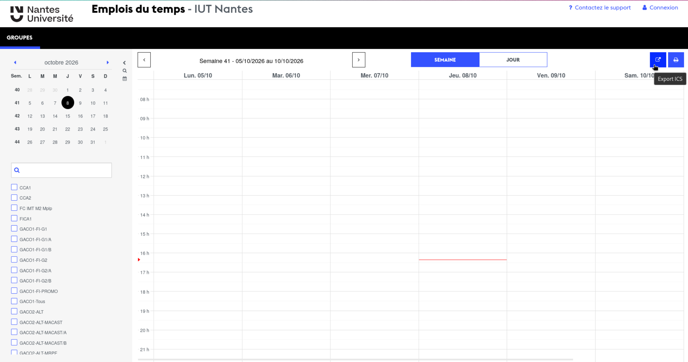
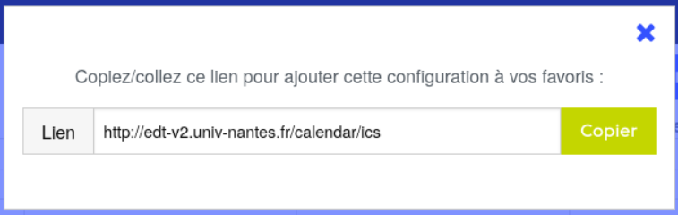
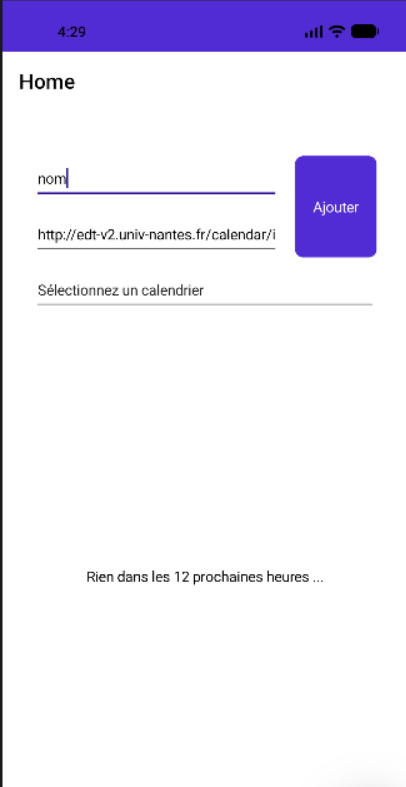
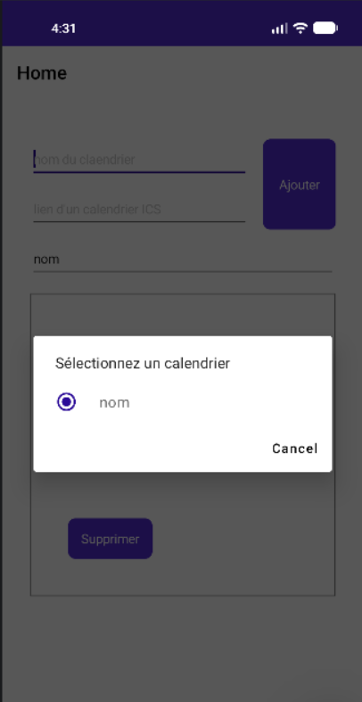
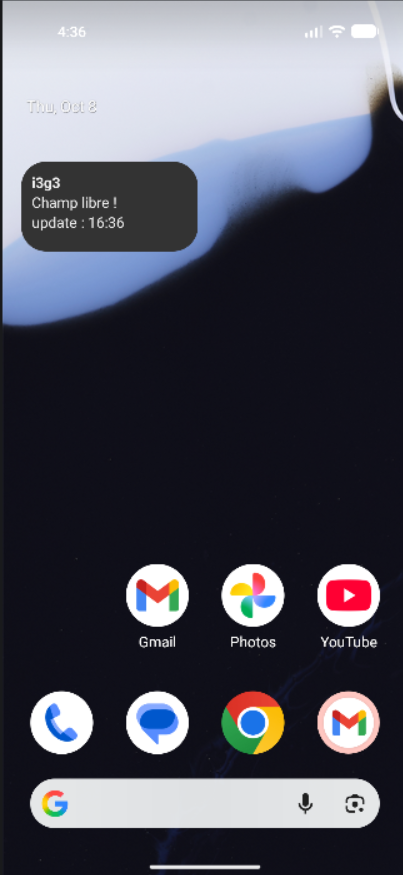

# RoomWidget

## Documentation Utilisateur

La dernière version de l'application est disponible dans les [releases](https://github.com/Mrpolopop/RoomWidget/releases) du dépôt.

### Ajout d'un calendrier

Pour ajouter un calendrier à l'application, il est nécessaire d'en avoir le lien ICS.
Pour les calendriers de l'université de Nantes, le lien est trouvable [ici](https://github.com/Mrpolopop/RoomWidget/releases), il suffit de séléctionner son calendrier et de cliquer sur le bouton d'export (en haut à droite).

Puis de copier le lien.

Et le coller dans l'application dans le champ *lien d'un calendrier ICS*.
Il faut aussi donner un nom au calendrier.

Pour décider du calendrier qui apparaitra dans le widget, il suffit de le séléctionner dans le menu déroulant.

Apres ça, il suffit d'ajouter le widget à l'écran d'accueil du téléphone.

